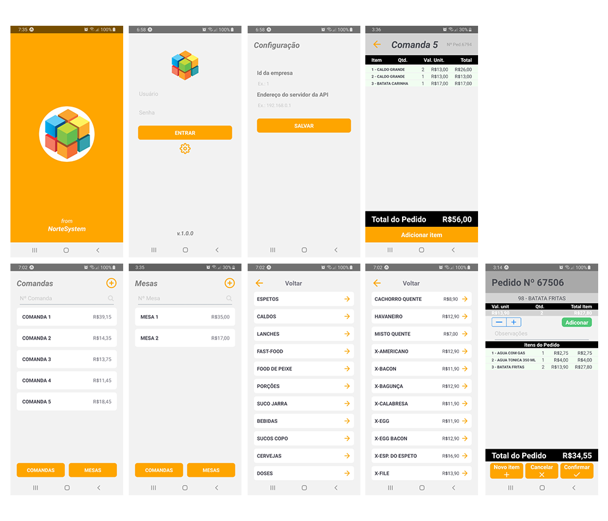

<h1 align="center">
    
</h1>

<h4 align="center">
  :iphone: Katarina Mobile
</h4>

 

  

  <a href="#rocket-tecnologias">Tecnologias</a>&nbsp;&nbsp;&nbsp;|&nbsp;&nbsp;&nbsp;
  <a href="#-projeto">Projeto</a>&nbsp;&nbsp;&nbsp;|&nbsp;&nbsp;&nbsp;
  <a href="#memo-licença">Licença</a>

 

  

## :crystal_ball: Tecnologias

Esse projeto foi desenvolvido com as seguintes tecnologias:

- [Node.js](https://nodejs.org/en/)
- [React Native](https://facebook.github.io/react-native/)
- [Expo](https://expo.io/)

## :mortar_board: Projeto

O Katarina Mobile é um projeto desenvolvido com intuito de cumprir os requisitos do desenvolvimento 
do projeto de trabalho de conclusão de curso do Centro Universitário São Lucas Ji-Paraná do curso de Sistemas de Informação. 

## :exclamation: Observações

- Algumas implementações do aplciativo não estão completas. 
- Este aplicativo foi projetado para ser executado exclusivamente no ambiente de produção do sistema Katarina, com as credenciais fornecidas por um supervisor.

## :scroll: Licença

Esse projeto está sob a licença MIT. Veja o arquivo [LICENSE](LICENSE.md) para mais detalhes.

---

By [Lucas Felício](https://github.com/lucasfelicio) :cactus:
